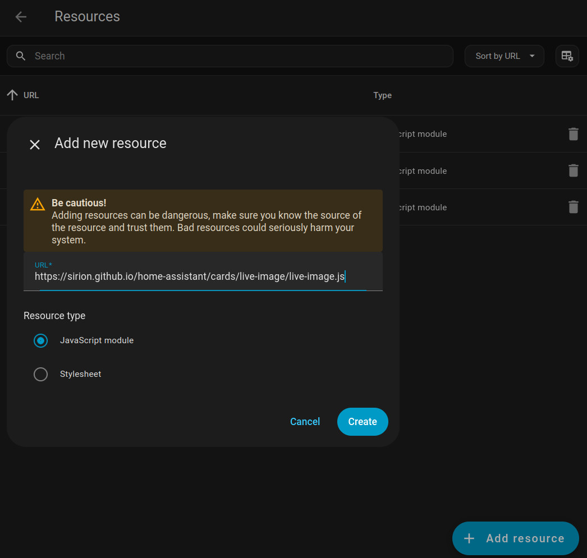

# Home Assistant Helpers

My Custom Cards, etc

## Live Image Card

A card that refreshes am image from a URL.
Can be used for webcam-images.

### Use

In Home Assistant 

- Go to `Settings` -> `Dashboards`
- Click the three dots on the upper right corner
- Choose `Resources`
- Click on the button `Add resource` in the lower right corner
- In the field named `URL`, enter "https://sirion.github.io/home-assistant/cards/live-image/live-image.js"
- For `Resource type` choose "Javascript module".
- Click `Create`.



You can now add the card named "Live Image" anywhere.

*(Alternatively, you can copy the `live-image.js`-file to your home assistant's "www"-directory and use the path `/local/live-image.js`.)*

### Configuration

You can use the visual editor.

Configuration options:

| Name | Default | |
|-|-|-|
| url| | URL of the image |
| refresh | 300 | Number of seconds between refreshes |
| useTimestamp | false | Adds a changing timestamp to the query of the image URL. This is known as a cache-buster and forces the browser to reload the image, even if if did not change on the server. |
| width | "" | (YAML config only) Width of the image (only use if you really need it) |
| height | "" | (YAML config only) Height of the image (only use if you really need it) |

Configuration example:

```yaml
type: custom:live-image
url: https://sirion.github.io/home-assistant/img/live-image.png
refresh: 300
useTimestamp: false
tap_action:
  action: url
  url_path: https://github.com/sirion/home-assistant/
```

### About `useTimestamp`

If this is not specified as `true`, the browser should honor the caching rules sent by the server.
This should result in much less traffic if the server is correctly configured. As the browser sends a conditional request, that should only return the full image data if the file has changed since the last request.

## TODOs

- Replace imagemagick in actions pipeline with a solution using fewer resources (that does not need apt installation)
